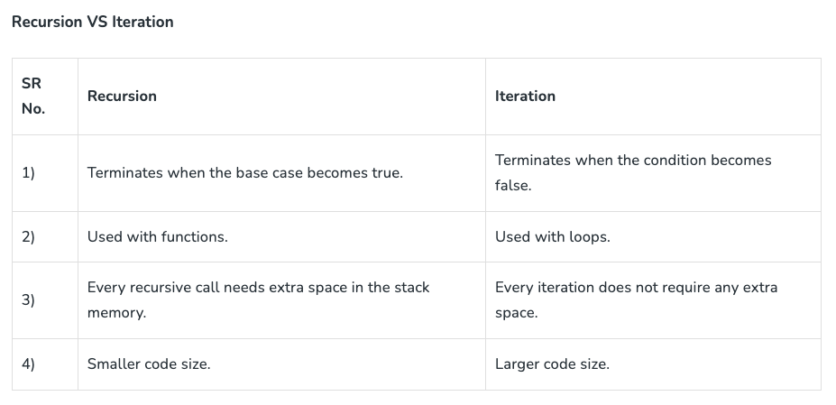

## Class 02
### In Tests We Trust - TDD with Python
[Source](https://code.likeagirl.io/in-tests-we-trust-tdd-with-python-af69f47e6932)

test name explains exactly what is being tested

Arrange - organize the data
Act - test the behavior
Assert - compare actual to intention

Cycle:
1. Write unit test
2. Write feature
3. Refactor

write code 
### If name equals main
[Source](https://www.geeksforgeeks.org/what-does-the-if-__name__-__main__-do/)

__name__ equals "__main__" if module is the main program
__name__ equals module's name if imported
__name__ is a global variable

if __name__ == "__main__" executes different sections of code depending on if it was imported or running standalone

### Recursion
[Source](https://www.geeksforgeeks.org/introduction-to-recursion-data-structure-and-algorithm-tutorials/)

Recursion uses more memory

I think the article has a typo, possibly? 

Instead of returning 1 when n = 0, based on the example code above it should return 1 when n <= 1, so it would also return 1 when equal n = 1

Direction vs indirect recursion
tailed vs non-tailed recursion

### What on Earth is Recursion
[Source](https://www.youtube.com/watch?v=Mv9NEXX1VHc)

### Python Modules and Packages Companion Video
[Source](https://www.youtube.com/watch?v=Mv9NEXX1VHc)

Modules can be written in Python or C
filename.__file__ shows where file is

#### Reading Questions

1. What are the key principles of Test-Driven Development (TDD) in Python, and how do they contribute to the overall quality of code? 

Tests are written before the code which improves the code quality

2. Explain the purpose of the if __name__ == '__main__': statement in Python scripts. What are some use cases for including this conditional in your code? 

It is to execute only specific lines of code depending on if the module is being imported or if it is the main module

3. Describe the concept of recursion in Python. 

Where a function calls itself directly or indirectly

4. What is the difference between Python modules and packages? Explain how to create, import, and use them in your Python programs.

Modules Package is a group of modules

import module_name or 
import module_name.function_name

create directory then create file module_name.py

#### Bookmark and Review

- [Google for Education: Python Lists]()
- [Google for Education: Python Strings]()
- [Python Modules and Packages]()
- [Pytest Documentation]()
- [PyTest Tutorial]()

#### Things I want to learn more about
- is software design part of SDLC?
- what is an empty name?
- More python conventions
- What exactly is a namespace?
