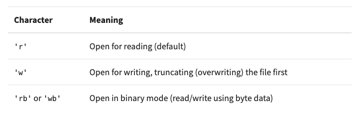
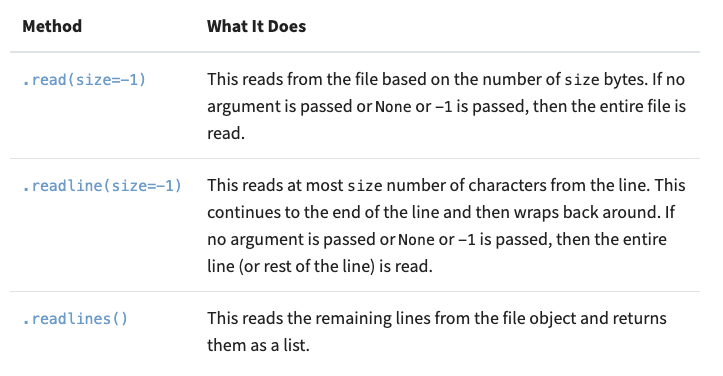
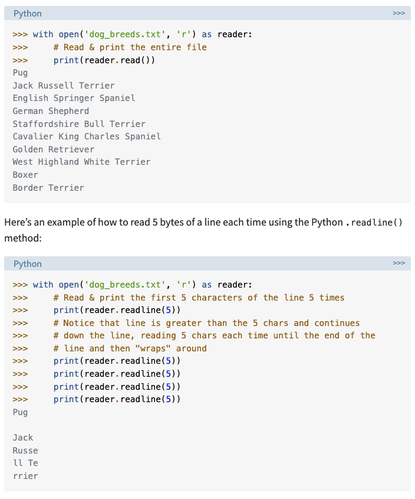
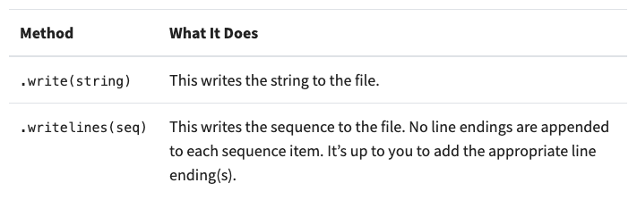
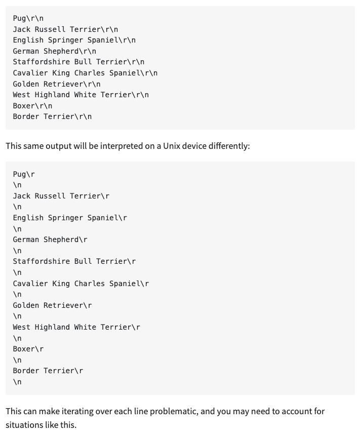

## Class 03

### Sources
- [Read & Write Files in Python](https://realpython.com/read-write-files-python/)
- [Exceptions in Python](https://realpython.com/python-exceptions/)
- [File Objects - Reading and Writing to Files](https://www.youtube.com/watch?v=Uh2ebFW8OYM)

### Notes

#### File Paths
Composition of a File
1. Header: its metadata such as file name, size, type, etc
2. Data: actual content
3. End of File (EOF): special character that denotes *end of file*

Every file type has a different format specification

File path is made of the folder_path/file_name.extension

Folder path in Unix is separated by forward slash / (down up) FDU
Folder path in Windox is separated a backslash \ (up down) BUD

The double-dot (..) can be chained to traverse multiple directories above the current directory

#### Line Endings
Carriage return vs Line Feed

#### Character Encodings

ASCII can only store 128 characters whereas UNICODE can have up to 1 million+ characters
ASCII is a subset of UNICODE

#### Opening and Closing a File in Python

`file = open('example_file.txt')`

or

`reader = open('example_file.txt')`
`try:`
`   #Code Block`
`finally: `
`   reader.close()`

both file and reader are potatoes/bananas

Another way to open and close

`with open('example_file.txt', 'r') as reader:`

***The with statement automatically closes the file onces leaves the with block***

the second argument refers to the mode. r stands for read-only. without the explicit 'r', the default behavior is still 'r'

#### Reading and Writing Opened Files

### read() vs readline(5) example

#### Exceptions vs Syntax Errors

`raise Exception` allows the dev to tailor the message received by exception error
`assert`

### Reading Questions
1. What is the purpose of the ‘with’ statement when opening a file in Python, and how does it help manage resources while reading and writing files? It automatically closes the file once it leaves the code block ensuring no resource leakage

2. Explain the difference between the ‘read()’ and ‘readline()’ methods for file objects in Python. Provide examples of when to use each method.
read() reads the entire file and readline() reads the entire line when no argument is passed. If an argument is passed then read(size) will read up to that argument's byte size, and readline(size) specifies the number of characters to return for each line. If the text exceeds the number of characters, then output to continue to the next line, Blank spaces equal one character.

Example in notes above, see read() vs readline(5)

3. Briefly describe the concept of exception handling in Python. How can the ‘try’, ‘except’, and ‘finally’ blocks be used to handle exceptions and ensure proper execution of code? Provide a simple example. Exception handling bypasses the application's normal behavior which is crashing when it encounters an error. Instead, the try: run this code, except: execute this code when there is an exception, finally: executes this code block always. 

### Bookmark and Review
[Reading and Writing Files in Python Quiz](https://realpython.com/quizzes/read-write-files-python/)
[ASCII](https://www.ascii-code.com/)
[Unicode](https://home.unicode.org/)
[open()](https://docs.python.org/3/library/functions.html#open)
[built-in Python exceptions](https://docs.python.org/3/library/exceptions.html)
### Things I want to learn more about or fully understand
- Carriage return vs Line Feed
- Unicode emojis
- What is a resource leak?

Is the below image saying Unix doesn't recognize the \r therefore it is read as part of the text/string?

