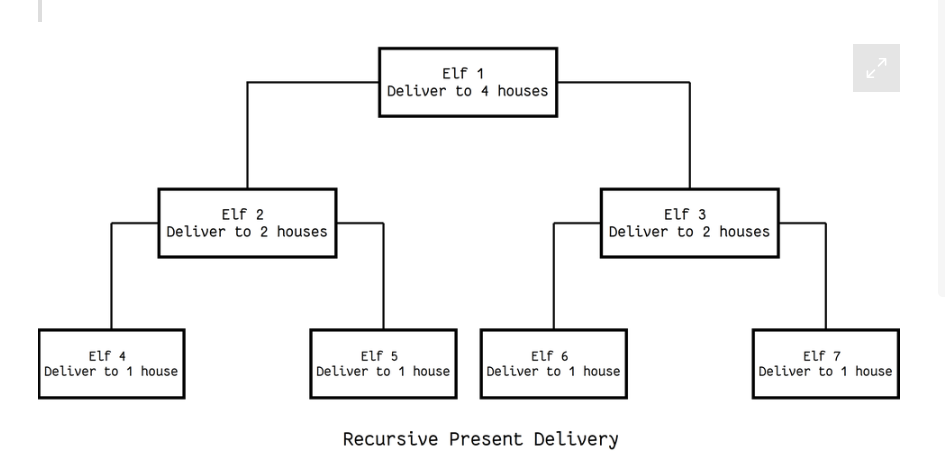

## Class 04

### Sources
- [Classes and Objects](https://www.learnpython.org/en/Classes_and_Objects)
- [Thinking Recursively](https://realpython.com/python-thinking-recursively/)
-[Pytest Fixtures and Coverage](https://www.linuxjournal.com/content/python-testing-pytest-fixtures-and-coverage)

### Notes
Classes are in upppercase. They are a blueprint/template of 

myobjectx = MyClass() then use dot notation to access its variables and methods(functions)

__init__() used to assign values in a class

since recursion is memory intensive, caching results can help eliminate unnecessary recomputation and reduce its memory load

This recursive algorithm looks a lot like the binary search

A recursive function is a function that repeats until a condition is met. That condition is the base case. 

A base case cannot be divided further

List, sets, tree, dictionary are all recursive data structures

from functools import lru_cache 
lru_cache uses a dictionary to cache results

@pytest.fixture
def function():

pytest --cov=mymul

### Reading Questions
1. What are the key differences between classes and objects in Python, and how are they used to create and manage instances of a class? 

Classes are the template or blueprint, and objects are instances of a particular class

2. Explain the concept of recursion and provide an example of how it can be used to solve a problem in Python. What are some best practices to follow when implementing a recursive function?

Recursion repeats itself until a condition is met and there is a variable that changes with each iteration. It can be used when the problem can be subdivided into a smaller "version of itself". An example in Python could be like removing items from a list, the remove repeats until there is nothing left to remove sort of like when a directory is deleted, the contents are emptied continually until there is nothing left to empty. Best practice is to always include a base case otherwise it will go into a infinite loop. 

3. What is the purpose of pytest fixtures and code coverage in testing Python code? Explain how they can be used together to improve the quality and maintainability of a project. Fixtures is accessible to other tests and can be passed into these other tests as a parameter. Code coverage checks to make sure your tests runs all the code and not just parts.  

### Bookmark and Review
[Pytest fixtures](https://docs.pytest.org/en/latest/explanation/fixtures.html)

### Topics I'd Like to Learn More About
- [decorators](https://realpython.com/primer-on-python-decorators/)
- how to draw and interpret a control flow diagram
- [garbage collection in Python](https://www.geeksforgeeks.org/garbage-collection-python/)

