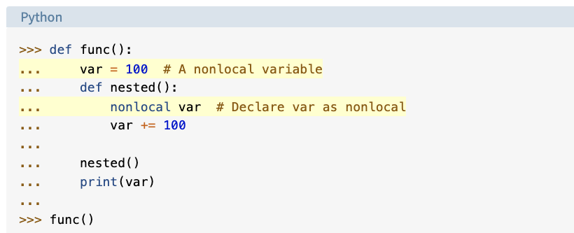

## Class 07

## Sources
[Python Scope](https://realpython.com/python-scope-legb-rule/)
[Big O notation is simpler than you might think](https://www.youtube.com/watch?v=dNorFNlDbX0)

## Notes

PEGB

any sequence that reaches a constant sequence after applying enough deltas is called a sequence of **polynomial growth**

polynomial of order n is where n specifies the number of deltas to arrive at a constant sequence

COOLLLLL

q is a polynomial of order 4 
for Big O, it would be written as q = O(n^4)

exponential growth is when delta n is equal to n

Big O is only concerned with the fastest growing part

Other growth rates
- constant
- logarithmic
- polynomial
- exponential
- factorial

## Bookmark and Review
[Rolling Dice Examples](https://artofproblemsolving.com/wiki/index.php/Basic_Programming_With_Python#Program_Example_1_3)

## Things I Want to Learn More About
- Number theory
- Stolz-Cesaro Theorem

## Reading Questions
1. Explain the concept of variable scope in Python and describe the difference between local and global scope. Provide an example illustrating the usage of both. local scope is when the variable is defined inside of a function and only that function has access to it whereas global is defined at the top of the module and all functions have access to it

2. How do the global and nonlocal keywords work in Python, and in what situations might you use them? The keywords allow you to modify standard behavior of scope

3. In your own words, describe the purpose and importance of Big O notation in the context of algorithm analysis. It is so you can compare two different algorithms to determine which will eventually be faster and more efficient as the size of the input grows

3. Based on the Rolling Dice Example, explain how you would simulate a dice roll using Python. Describe how you would use code to calculate the probability of rolling a specific number (e.g., the probability of rolling a 6) over a large number of trials. use randint(1,6) to simulate a dice roll. to calculate probability, maybe use a dictionary to get the count of a specific number divided by total number of rolls. 