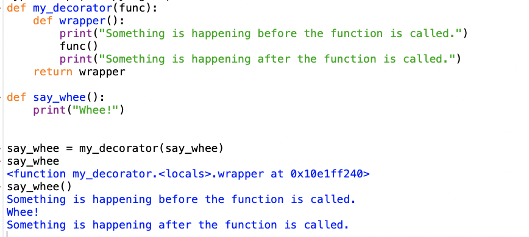

## Class 08

The following readings and videos are important because Python's comprehension features increase its readability and enhance 

## Sources
- [List Comprehension](https://www.pythonforbeginners.com/basics/list-comprehensions-in-python)
- [Debugging with PySnooper](https://www.pythonpodcast.com/pysnooper-python-debugging-episode-241/)


## List Comprehension Notes

### syntax for list comprehension


starting backwards

iterable_object refers to anything iterable meaning you can loop through it such as list, tuple, set, string, **FILES**  .....

item refers to element in the iterable_object

expression represents the operation that is performed on each element or item in the iterable object

the result of the list comprehension is assigned to my_new_list

*How does the comprehensions compare to arrow functions in JavaScript?*

- [Python comprehensions vs JavaScript arrow functions - ChatGPT explanation](https://chat.openai.com/c/ae6d1b18-6b01-4020-aed8-1ebb23bdab04)

### Example


### Adding conditional expressions

Syntax

`my_new_list = [ expression for item in iterable_object conditional statement/evaluation]`

functions are added to the expression

Examples


Conditional statements act as a **filter**


### The Beauty of List Comprehensions


### More Examples


### Useful example to apply to webscraping output possibly ...


### Parsing a File


### Delimiters

<hr>

## Primer on Python Decorator Notes

A decorator is a function that takes another function and extends the behavior of the second function

Functions are first-cass objects that can be passed around and used as arguments

When a function is named without parentheses, only the reference to the function is passed and the function is not executed

`greet_bob(say_hello)`

say_hello is a reference

inner functions are functions defined inside other functions and are locally scoped to the enclosing function


### Returning Functions from Functions


## PySnooper
1. pip install PySnooper
2. import PySnooper
3. add snooper.pysnooper decorators


## Bookmark and Review
- [Primer on Decorators](https://realpython.com/primer-on-python-decorators/)

## Reading Questions

1. What is the basic syntax of Python list comprehension, and how does it differ from using a for loop to create a list? Provide an example of a list comprehension that squares the elements in a given list of integers.

*syntax as follows*

variable = [expression for item in iterable_objection conditional statement]

*example of list comprehension* 

`numbers = [2, 4, 8, 12]`

`squared = [num**2 for num in numbers]`


2. What is a decorator in Python? a function that extends another function

3. Explain the concept of decorators in Python. How do they work, and what are some common use cases for them? Provide an example of a simple decorator function from the reading.



According to [ChatGPT](https://chat.openai.com/c/90d826a9-2c57-4fda-95a9-a58cd6af3c54), 

In Python, decorators are a powerful and flexible way to modify or extend the behavior of functions or methods without changing their actual code. They are essentially higher-order functions that take another function as an argument and return a new function that usually extends or enhances the original function's functionality. Decorators are commonly used for tasks like logging, authentication, validation, and more.

Here's how decorators work in Python:

1. A decorator is a function that takes another function as its argument.
2. The decorator can modify or enhance the functionality of the input function or execute code before and after it.
3. The decorator returns a new function that can be used in place of the original function.

Common use cases for decorators include:

1. **Logging**: You can use decorators to log information about when a function is called, what arguments it's called with, and what it returns.

2. **Authentication and Authorization**: Decorators can be used to check if a user is authenticated and authorized to access a specific resource or perform an action.

3. **Caching**: You can create decorators that cache the results of a function to avoid recomputation when the same inputs are provided.

4. **Validation**: Decorators can be used to validate input arguments before a function is executed.

5. **Timing and Profiling**: Decorators can be used to measure the execution time of functions or collect profiling data.

Here's an example of a simple decorator function in Python:

```python
def my_decorator(func):
    def wrapper():
        print("Something is happening before the function is called.")
        func()
        print("Something is happening after the function is called.")
    return wrapper

# Using the decorator
@my_decorator
def say_hello():
    print("Hello!")

say_hello()
```

In this example, `my_decorator` is a decorator function that takes another function `func` as its argument. It defines a `wrapper` function that includes additional code to be executed before and after calling the original function. When we use `@my_decorator` above the `say_hello` function, it is equivalent to calling `say_hello = my_decorator(say_hello)`. So, when we call `say_hello()`, it actually calls the `wrapper` function, and you will see the messages before and after "Hello!" is printed.

Output:
```
Something is happening before the function is called.
Hello!
Something is happening after the function is called.
```

This is a simple example, but decorators can become much more complex and versatile, making them a powerful tool for extending and modifying the behavior of functions in Python.


## Things I Want to Learn More About
- Are comprehensions algorithmically more efficient?
- [String Indexing](https://www.pythonforbeginners.com/strings/string-indexing-in-python)
- [Dictionary Comprehension](https://www.pythonforbeginners.com/dictionary/dictionary-comprehension-in-python)
- [String Concatenation](https://www.pythonforbeginners.com/concatenation/string-concatenation-and-formatting-in-python)
- [Iterators & Iterables](https://realpython.com/python-iterators-iterables/)
- Rust
- Fintech
- [PySnooper](https://github.com/cool-RR/PySnooper/?utm_source=rss&utm_medium=rss)
- [Wing IDE](https://wingware.com/?utm_source=rss&utm_medium=rss)
- [Higher-order functions](https://en.wikipedia.org/wiki/Higher-order_function)
- [Functional Programming in Python](https://realpython.com/python-functional-programming/)