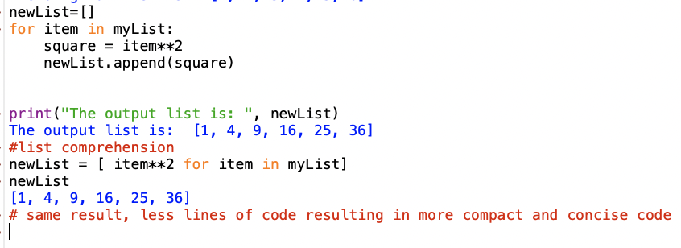

## Class 08

The following readings and videos are important because Python's comprehension features increase its readability and enhance 

## Sources
- [List Comprehension](https://www.pythonforbeginners.com/basics/list-comprehensions-in-python)
- [Debugging with PySnooper](https://www.pythonpodcast.com/pysnooper-python-debugging-episode-241/)

## Notes

### syntax for list comprehension

starting backwards

iterable_object refers to anything iterable meaning you can loop through it such as list, tuple, set, string, **FILES**  .....

item refers to element in the iterable_object

expression represents the operation that is performed on each element or item in the iterable object

the result of the list comprehension is assigned to my_new_list

*How does the comprehensions compare to arrow functions in JavaScript?*

- [Python comprehensions vs JavaScript arrow functions - ChatGPT explanation](https://chat.openai.com/c/ae6d1b18-6b01-4020-aed8-1ebb23bdab04)

### Example

### Adding conditional expressions

Syntax

`my_new_list = [ expression for item in iterable_object conditional statement/evaluation]`

functions are added to the expression

Examples

Conditional statements act as a **filter**

### The Beauty of List Comprehensions

### More Examples

### Useful example to apply to webscraping output possibly ...

### Parsing a File

### Delimiters

## Bookmark and Review
- [Primer on Decorators](https://realpython.com/primer-on-python-decorators/)

## Reading Questions

1. What is the basic syntax of Python list comprehension, and how does it differ from using a for loop to create a list? Provide an example of a list comprehension that squares the elements in a given list of integers.

*syntax as follows*

variable = [expression for item in iterable_objection conditional statement]

*example of list comprehension* 

`numbers = [2, 4, 8, 12]`

`squared = [num**2 for num in numbers]`

2. What is a decorator in Python?

3. Explain the concept of decorators in Python. How do they work, and what are some common use cases for them? Provide an example of a simple decorator function from the reading.

## Things I Want to Learn More About
- Are comprehensions algorithmically more efficient?
- [String Indexing](https://www.pythonforbeginners.com/strings/string-indexing-in-python)
- [Dictionary Comprehension](https://www.pythonforbeginners.com/dictionary/dictionary-comprehension-in-python)