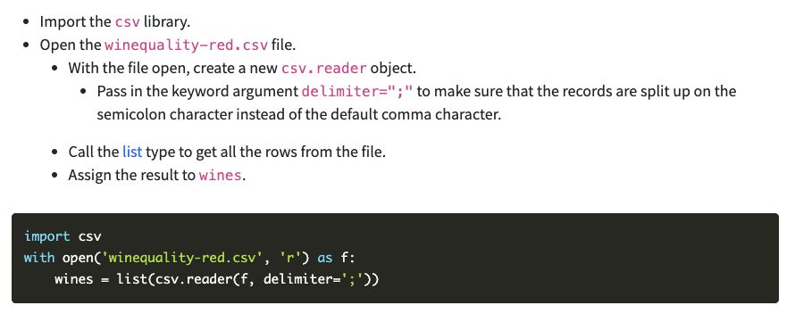
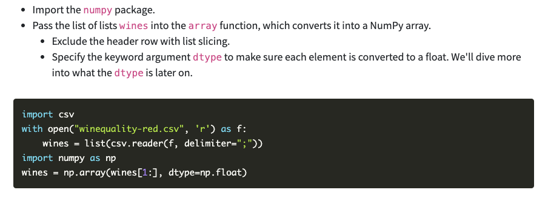

# Class 11

## Sources
- [What is Jupyter Lab](https://jupyterlab.readthedocs.io/en/stable/getting_started/overview.html)

- [Numpy Tutorial](https://www.dataquest.io/blog/numpy-tutorial-python/)

## Jupyter Notes

|image shortcuts| action |
|------------------| -----|
|- or = | zoom in/out
|[ or ] |rotate left/right|
|0|reset|

|command shortcuts|action|
|----|---|
|use arrow key up/down| navigate up/down cells|
|arrow up + a | add cell *above*|
|arrow down + b |add cell *below*|
|c |copy a cell|
|v |paste a cell|
|x | cut a cell|
|d d |to delete|
|z |undo|
|shift + z | redo|
|y | code|
|m |markdown|

edit mode supports 
- H1 - H6
- italics using single * vs bold **
- \- unordered list vs 1. ordered list
- \> blockquote
- \--- horizontal line
- \`\`\` inline code
- $ equations

|code mode | shortcuts |
| ----|----|
| shift + enter | run code in cell |

## Numpy Notes

1. import csv libary
2. with open statement
3. create new csv.reader object
4. pass in correct delimiter

use Numpy for data analysis and machine learning

2-d array is a matrix
1-d array is a vector

"In a Numpy array, the number of dimensions is called the rank and each dimension is called an axis."

all elements in a numpy array have to be of the same type

- numpy.array (function)
- numpy.float
- numpy.shape (property)
- np.zeros

## Bookmark and Review
[Numpy Arrays](https://www.tutorialspoint.com/numpy/index.htm)

## Reading Questions
1. What are the key features and benefits of Jupyter Lab, and how does it differ from Jupyter Notebook? Key features include the ability to run code and anotate alongside it using markdown, allows various formats, etc. New features available in Jupyter Lab include the ability to drag and drop cells to rearrange the notebook or copy content, tab completion, ability to scroll lengthy outputs, a new cell toolbar feature, and a few other additions. 

2. What are the main functionalities provided by the NumPy library, and how can it be useful in Python programming, particularly for scientific computing and data manipulation tasks? Numpy is great for data analysis and machine learning models because it can handle large datasets. 

3. Explain the basic structure and properties of NumPy arrays, and provide examples of how to create, manipulate, and perform operations on them. Numpy arrays must contain the same data type, and are multidimensional. 

## Things I need to revisit
- I/O files
- [NumPy documentation](https://numpy.org/)
- [data science cheat sheet](https://s3.amazonaws.com/dq-blog-files/numpy-cheat-sheet.pdf)