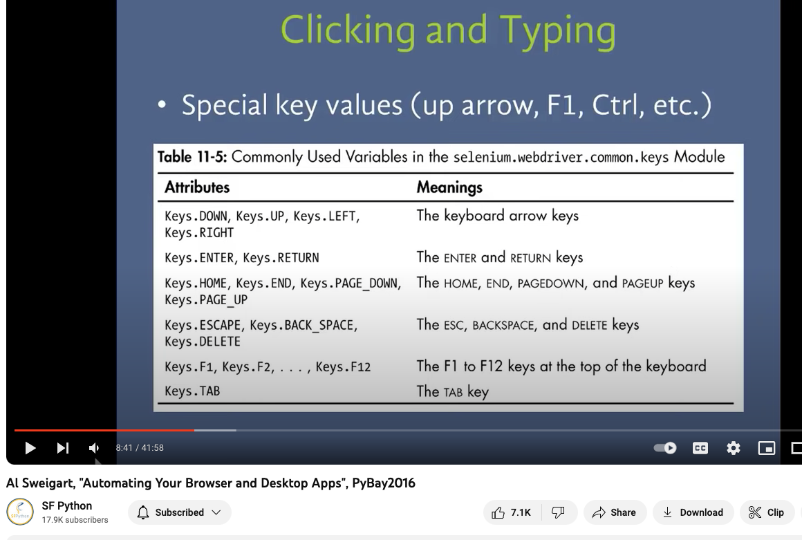
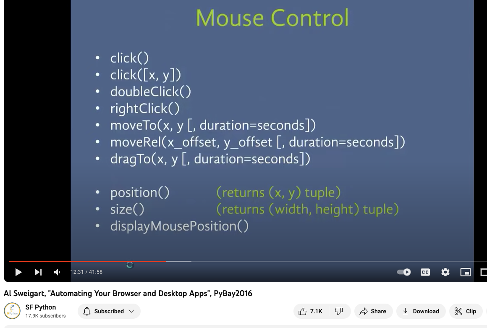

# Class 18 - Automation

### RegEx Notes
RegEx use-cases
- search engines
- search and replace tools in word processors and text editors
- search for customer data in a database?
- email format validation
- password format validation
- to parse text data files
- data mining

Python Module Name: `re`

### Basic/Ordinary characters
- simplest
- match themselves exactly at literal face value and do not have a special meaning
- includes most of the alphabet

### Wild/Special characters
- do not match themselves. they represent something else. 

`.` a period matches **any single character** except the newline character

`^` a caret matches the **start** of the string **except** when used within a range. In that instance, it means **any, except** e.g. any character except 5 is shown as`[^5]`

`$` a dollar sign matches the **end** of a string

`[abc]` this example matches a, b, **or** c

`[a-zA-z0-9]` this example matches any letter from (a-z) or (A-Z) or (0-9). the `-` indicates the start/end of the range of characters. there is an understood order

`\` backslash has multiple meanings
- if the character following the backslash is a recognized escape character, then the special meaning of the term is taken
- if not an escape character, then the backslash is interpreted and stored at literal face value
- can also be used in front of all metacharacters (wild/special) to remove their special meanings

Recognized escape characters
`\s` space

`\n` newline?

`\w` lowercase w matches any single letter, digit, or underscore

`\W` uppercase W matches any character not part of `\w` so everything else except single letter, digit, or underscore

`\s` lowercase s matches a single whitespace character like space, newline, return 

`\S` uppercase S matches any character not part of `\s` so everything else except space, newline, return

`\d` lowercase d matches decimal digit 0-9

`\D` uppercase D matches any character that is not a decimal digit

`+` plus symbol is used for repetition

`\t` lowercase t matches tab

`\n` lowercase n matches newline

`\r` lowercase r matches return

`\A` uppercase A matches only at the start of a string. works across **multiple lines**

`\Z` uppercase Z matches only at the end of a string

`\b` lowercase b matches only the beginning or end of the word

### Repetitions

`+` checks if the preceding characters appears one or more
`*` zero or more
`?` one or zero
`{x}` exactly x number of times
`{x,}` x or more number of times
`{x,y}` between x and y times, inclusive

### Groups and Named Groups
parts of a regex bounded by () are called groups

### Greedy vs Non-greedy Matching
+ and * are greedy

# Compilation Flags

re methods
- compile()
- `search()` scans the given string/sequence looking for the first instance where the regex produces a match
- findall()
- sub()
- split()
- `group()` returns the string matched

- `match()` returnsa match object if the text matches the pattern, otherwise it returns None

r"Cookie" <- r is an example of a "raw string literal". A raw string literal changes how the string is interpreted by storing them as they appear. I guess that means if there is no r, it must is encoded or something along those lines. 

Summary Table from the reading

### Shutil notes
Purpose: High-level file operations

Python Module Name `shutil`

other librairies: `glob`, `io`, `os`, `sys`

Operations
- Copying Files `copyfile()` copies the contents of the source to the destination
- Copying File Metadata `copymode()` copies the permissions from one file to another
- Working with Directory Trees `copytree()` copy a directory from one place to another
- Finding Files `which()` scans a search path looking for a named file
- Archives `get_archive_formats()` returns a sequence of names and descriptions for formats supported on the current system
- File System Space `disk_usage()` returns a tuple with the total space, the amount currently being used, and the amount remaining free

### os notes
Purpose: Portable access to operating system specific features. Module provides a wrapper for platform specific modules. 

Python Module Name `os`

#### Operations

**Examining the File System Contents**

- `listdir()` prepares a list of the contents of a directory on the file system
- `walk()` traverses a directory recursively
- `scandir()` collects more information than just the names of the directory

**Managing File Permissions**
- `stat()` or `lstat()` gives detailed information about a file such as size, permissions, owner, device, creation date, last modified, last accessed
- `chmod()` change file permissions on Unix-like systems
- `access()` can be used to test access rights a process has for a file

**Creating and Deleting Directories**
- `mkdir()` make a new directory, parent directories must exist
- `makedirs()` make a new directory, creates any parts of the path that do not exist
- `rmdir()` remove leaf directory
- `removedirs()` remove all of the parent directories

***and more***
- Working with Symbolic Links `symlink()` creates a symbolic link, `readlink()` reads to determine if original file is pointed by the link
- Safely Replacing an Existing File `rename()` and `replace()`
- Deleting and Changing the Process Owner `getuid()` and `geteuid()` determines and chnages the process owner
- Managing the Process Environment `environ()` and `getenv()`
- Managing the Process Working Directory `getcwd()` and `chdir()`
- Running External Commands `system()`
- Creating Processes with os.fork() `fork()` and `exec()`
- Waiting for Child Processes `wait()`
- Spawning New Processes `spawnlp()`
- Operating System Error Codes `strerror()`

### Automation Ideas
- automatically move files
- auto move and rename files
- look for new videos
- calculate compounding interest

### Al Sweigart
- web scraping
- gui automation <- control the mouse and keyboard, library: pyautogui

#### Selenium 
librairies: selenium (can only use on web apps)
`from selenium import webdriver`
`browser = webdriver.Chrome()`
`browser.get('http://google.com')`
`browser.find_element_by_css_selector(#)`

- .text
- .click()
- .send_keys()
- .submit()
- .get_attriute('attr')

#copy selector in chrome dev tools refers to css selector

- browser.back()
- browser.forward()
- browser.refresh()

#### PyAutoGUI
`import pyautogui`

pyautogui.locateOnScreen('image.png') -> image coordinates(x, y, width, height):  
pyautogui.locateCenterOnScreen('image.png')
pyautogui.click((x, y)) <- x, y is the coordinates

## Sources
- [Python Regular Expressions Tutorial by DataCamp](https://www.datacamp.com/tutorial/python-regular-expression-tutorial)
- [shutil](https://pymotw.com/3/shutil/)
- [os](https://pymotw.com/3/os/)
- [Video: Automation Ideas](https://www.youtube.com/watch?v=qbW6FRbaSl0&t=69s)
- [Optional Video: Automating Your Browser and Desktop Apps](https://www.youtube.com/watch?v=dZLyfbSQPXI)

## Bookmark and Review
- [Watchdog](https://pythonhosted.org/watchdog/)

## Things I want to learn more about
- [re](https://docs.python.org/3/library/re.html)
- [PyMOTW-3](https://pymotw.com/3/index.html)
- [Selenium](https://www.selenium.dev/)
- [PyAutoGUI](https://pyautogui.readthedocs.io/en/latest/)
- [OpenCV](https://opencv.org/)
- [AutoIt](https://www.autoitscript.com/site/autoit/)
- [AutoHotKeys](https://www.autohotkey.com/)
- [glob](https://docs.python.org/3/library/glob.html)

## Reading Questions
1. How can you use regular expressions in Python to search for specific patterns in a string, and what is the primary module to work with them?
> re is the primary module. First, you create a regex pattern, then have the re methods check against the pattern. 
2. What is the purpose of the shutil module in Python, and provide an example of a common use case for file or directory management with this module?
> Use it for high-level file operations such as copying, archiving, checking file disk space. 
3. Compare and contrast the os and shutil modules. When would you choose to use one over the other?
> os' purpose is for 'portable access to operating system specific features' whereas shutil's purpose is for high-level file operations. Use os when you need to read, write to the file system, interact with process environments. Use shutil when you need to copy, move, or remove files. [ChatGPT prompt](https://chat.openai.com/c/e5bf6c8c-ed47-402c-8c65-5d45fe165533)