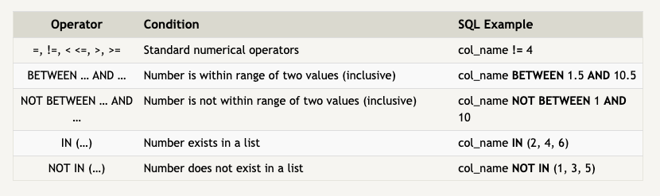
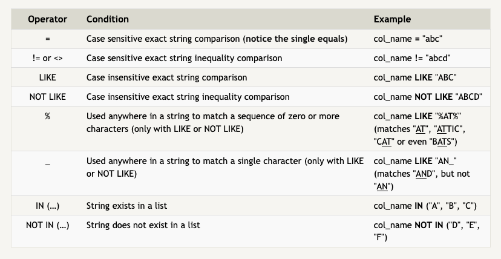
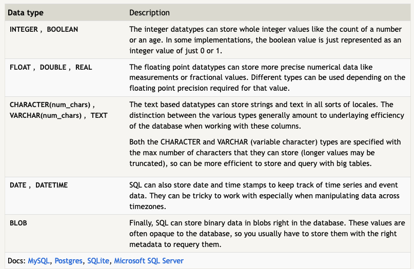
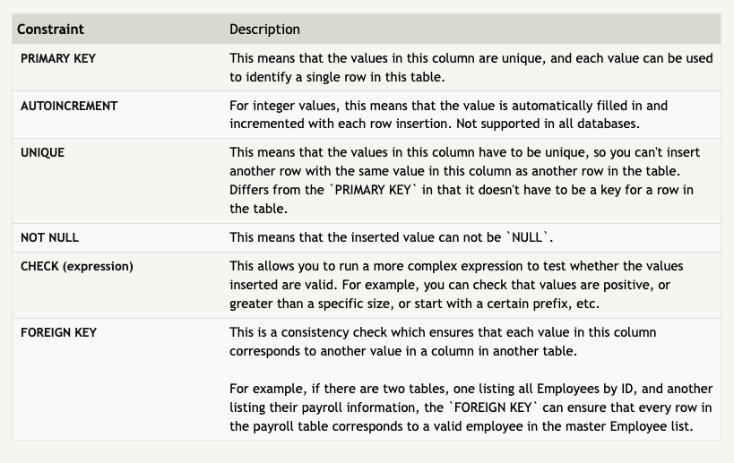

## SQL Practice

SQL is a powerful database language used to create and access data in a relational databases.
A relational database consists of tables that are related to one another either by sharing a common key or another identifying factor.

### Completed Exercises 1-6 and 13-18

### Cheat Sheet

